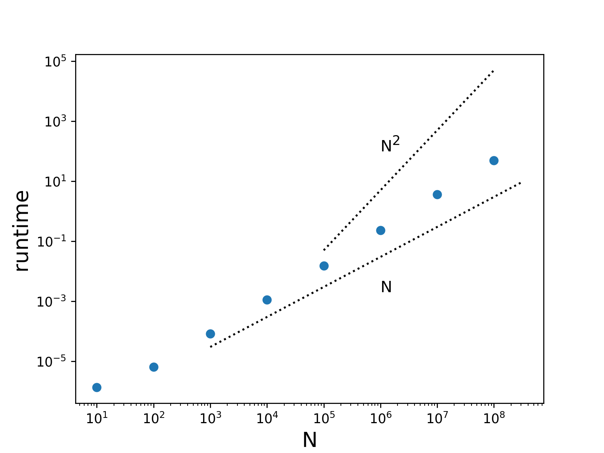

# Non-Functional Testing

Everything up to this point has been functional testing where we have looked to see if the outputs agree with the expected outputs. Non-functional testing looks at other aspects such as computational complexity, performance, scalability, security, etc.

## Computational complexity in runtime and memory

Consider the simple code below:

```python
from random import random

N = 1000
x = [random() for _ in range(N)]
for i in range(N):
    x_sum += x[i]
```

What is the computational complexity in time and memory for this `for` loop? The answer is that the memory requirement grows linearly with N
and so does the execution time of the code. That is, if N is doubled the code requires twice as much memory and twice as much runtime.

What about this example?

```python
from random import random

N = 1000
x = [random() for _ in range(N)]
x_min = 0.0
for i in range(N - 1):
    for j in range(i + 1, N):
        xij = abs(x[i] - x[j])
        if xij < x_min: x_min = xij
```

The above is O(N) in memory and O(N^2) in runtime. This means when N is doubled the runtime increases by approximately a factor of 4. For more on computational complexity see this [Wikipedia page](https://en.wikipedia.org/wiki/Computational_complexity_of_mathematical_operations).

## Python sort()

What is the computational complexity of Python's built-in sort function?

```python
from random import random
from time import perf_counter

times = []
for N in map(int, [10, 100, 1000, 10000, 100000, 1e6, 1e7, 1e8]):
  x = [random() for _ in range(N)]
  t0 = perf_counter()
  x.sort()
  times.append((N, perf_counter() - t0))
```



We see that the scaling behavior is closer to O(N) than O(N^2). According to the web the algorithm is O(N log N).
